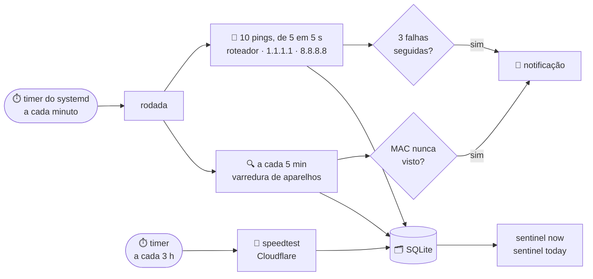

# 🛰️ sentinel

**O vigia da rede de casa.** Mede a internet o tempo todo, testa a velocidade,
sabe quem está conectado no Wi-Fi e avisa na área de trabalho quando algo muda.


---

## O que ele faz

| | |
|---|---|
| 📶 **Mede a internet** | A cada 5 segundos, pergunta "você está aí?" ao roteador e a dois servidores na internet. Guarda quanto tempo cada resposta levou. |
| 🚀 **Testa a velocidade** | A cada 3 horas, mede download e upload, os mesmos números do plano da operadora. |
| 🔍 **Vê quem está conectado** | A cada 5 minutos, descobre todos os aparelhos da rede: celular, notebook, TV. |
| 🔔 **Avisa quando algo muda** | Internet caiu, internet voltou, aparelho novo na rede. |
| 🗂️ **Guarda o histórico** | Tudo fica num arquivo no próprio PC, para responder "como foi a internet hoje?". |

### E descobre de quem é a culpa

Quando a internet cai, o `sentinel` olha também para o roteador:

- **o roteador responde, a internet não** → o problema é da **operadora**;
- **nem o roteador responde** → o problema é **dentro de casa** (roteador ou cabo).

---

## Como fica na tela

```console
$ sentinel now
Internet: OK — 20 ms até a operadora, 0 ms até o roteador
Últimos 5 min: perda 0,0%, jitter 1 ms
Velocidade: 671 Mbps download · 177 Mbps upload (teste há 1 h)

Aparelhos na rede (5), varredura agora:
  192.168.0.1     Roteador                         D8:44:89
  192.168.0.2     desconhecido                     MAC aleatório
  192.168.0.3     desconhecido                     MAC aleatório
  192.168.0.4     desconhecido                     MAC aleatório
  192.168.0.13    TV sala (LGwebOSTV)              Arcadyan Corporation
```

```console
$ sentinel today
Hoje até 21:30
Latência média 19 ms · pior momento 21:02 (240 ms) · perda 0,3% · jitter 3 ms
Velocidade: 7 testes · download médio 620 Mbps (menor 480 Mbps às 18:17) · upload médio 160 Mbps
Quedas: 1 — 14:10 a 14:13 (3 min, operadora)
Aparelhos novos: 1 — MAC aleatório, 192.168.0.21 às 18:40
```

E as notificações:

| Quando | O aviso |
|---|---|
| Primeira vez que roda | **Lista inicial criada** — 5 aparelhos aceitos como conhecidos |
| A internet cai | **Internet caiu** — às 21:14, roteador OK, problema na operadora |
| O roteador some | **Rede de casa caiu** — às 21:14, roteador não responde |
| Volta | **Internet voltou** — às 21:17, ficou fora 3 min |
| Aparelho nunca visto | **Aparelho novo na rede** — Samsung, 192.168.0.21 |

> Não sabe o que é latência, jitter ou MAC? Está tudo explicado em linguagem
> simples em [`docs/rede.md`](docs/rede.md).

---

## Como funciona



- **Uma rodada por minuto.** O systemd dispara `sentinel collect`, que mede por
  ~45 s e termina. Se algo der errado, o minuto seguinte começa limpo.
- **Queda só com confirmação.** Um ping perdido não é queda: são precisas 3 falhas
  seguidas (15 s) para avisar, e 3 respostas para dizer que voltou.
- **Suspender o PC não vira queda.** O tempo suspenso fica como buraco no histórico.
- **Velocidade sem atrapalhar a latência.** Durante o speedtest a conexão fica cheia;
  os pings desses segundos não entram na latência
  ([ADR-0004](docs/adrs/0004-speedtest-pela-cloudflare.md)).
- **Sem permissão de administrador.** A descoberta usa o `ping` do sistema e a tabela
  de vizinhos que o Linux já mantém ([ADR-0003](docs/adrs/0003-descoberta-sem-root.md)).

---

## Começar

**Precisa de:** Linux com systemd, [`uv`](https://docs.astral.sh/uv/), `make`, `ping`
e `notify-send`. Para nome e fabricante dos aparelhos, `avahi-resolve` e o pacote
`ieee-data`.

**1. Instalar**

```bash
make install
```

**2. Dizer qual é a sua rede**

```bash
mkdir -p ~/.config/sentinel
cp config.example.toml ~/.config/sentinel/config.toml
```

```toml
gateway = "192.168.0.1"              # o roteador
subnet = "192.168.0.0/24"            # a rede da casa
internet_targets = ["1.1.1.1", "8.8.8.8"]
```

Não sabe os seus? `ip route | grep default` mostra o roteador depois de `via`. A
rede é esse endereço com o último número trocado por `0/24`.

**3. Ligar**

```bash
make install-timer
```

Pronto. Em cerca de 1 minuto chega a notificação "Lista inicial criada". O primeiro
teste de velocidade roda no próximo horário (00:17, 03:17, 06:17…).

---

## Comandos

| Comando | O que faz |
|---|---|
| `uv run sentinel now` | Como está a rede agora |
| `uv run sentinel today` | Resumo do dia |
| `uv run sentinel name 192.168.0.13 "TV sala"` | Dá apelido a um aparelho (aceita IP ou MAC) |
| `uv run sentinel speedtest` | Mede download e upload agora |
| `uv run sentinel collect` | Uma rodada na mão (é o que o timer roda) |
| `make uninstall-timer` | Desliga o vigia |

| Onde fica | |
|---|---|
| Configuração | `~/.config/sentinel/config.toml` |
| Histórico | `~/.local/share/sentinel/sentinel.db` |
| Log | `journalctl --user -u sentinel -u sentinel-speedtest` |

---

## Limites

Sendo honesto sobre o que ele ainda não faz:

- **Só mede com o PC ligado.** Desligado ou suspenso, fica buraco no histórico.
- **Mede a internet, não o Wi-Fi.** O PC está no cabo.
- **Celular com MAC aleatório** pode trocar de MAC e aparecer como "novo" de novo.
- **Cada minuto tem ~15 s sem medição.** Queda de 25 s ou mais é sempre pega.
- **O speedtest gasta banda:** até ~170 MB por teste, ~1,4 GB por dia. E usa os
  endereços de teste do site da Cloudflare, que não são uma API oficial.

O que vem depois — aviso de velocidade baixa, gráficos, rodar 24 h, integração com o Jarvis — está
no [roadmap](docs/roadmap.md).

---

## Por dentro

Ports & Adapters: o núcleo não sabe que existe `ping`, SQLite ou terminal.

```text
src/sentinel/
├── core/        modelos e contratos (portas)
├── app/         o que o sistema faz: rodada, regra de queda, relatórios
├── probing/     ping
├── speed/       speedtest (Cloudflare)
├── discovery/   tabela ARP, avahi, fabricantes
├── storage/     SQLite
├── notify/      notify-send
└── channels/    o comando sentinel
```

As decisões e o porquê de cada uma:

- [ADR-0001](docs/adrs/0001-timer-em-vez-de-daemon.md) — timer a cada minuto em vez de programa ligado direto
- [ADR-0002](docs/adrs/0002-sqlite-e-retencao.md) — SQLite, com ping por 30 dias e resumo por minuto para sempre
- [ADR-0003](docs/adrs/0003-descoberta-sem-root.md) — descoberta de aparelhos sem permissão de administrador
- [ADR-0004](docs/adrs/0004-speedtest-pela-cloudflare.md) — speedtest pela Cloudflare, a cada 3 horas

### Desenvolvimento

```bash
make test     # a suíte roda sem rede real
make check    # lint + formato + testes, o mesmo que o CI
```

Teste vermelho não vira commit: o pre-commit bloqueia. As regras do projeto estão no
[`CLAUDE.md`](CLAUDE.md).
